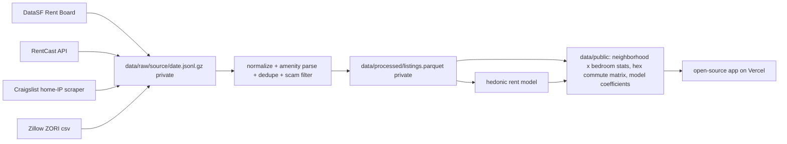

# SF Apartment Rent Data Plan

Data acquisition plan for an SF apartment rent calculator/visualizer: how much listing data
is needed, which sources supply which features, collection cadence and budget, and the
storage/legal layout that lets the raw data stay private while the code and app are
open-sourced on Vercel.

## 1. What the tool computes (drives the data needs)

- Input: bedrooms, bathrooms, sqft, location (neighborhood or point), adjustable work location + commute mode, amenities (laundry, kitchen, parking, pets, etc.).
- Output: (a) expected monthly rent with a range, from a hedonic model; (b) map/chart views of rent vs. commute time, neighborhood premiums, amenity premiums; (c) later, "deals" among live listings.
- Data therefore needs: a large, geo-located, time-stamped set of unit-level rents with structural features, plus a smaller amenity-rich subset, plus a commute layer.

## 2. How much data is enough

- Time window: **2022-01-01 forward, all sources.** Rent Board records are kept only if the tenancy started in 2022 or later; RentCast pulls are bounded with `daysOld` to listings first listed in 2022+; ZORI is trimmed to 2022-01 onward; no pre-2022 historical datasets are loaded.
- Sizing logic: SF has 37 analysis neighborhoods x 5 bedroom classes (studio to 4+) = ~185 cells. Stable neighborhood-level estimates need >= 30 observations per cell -> ~6,000 minimum. Amenity premiums (3 laundry levels, parking, pets, kitchen type, building type) with interactions need ~15k-25k records for tight coefficients (rent SD is ~$1,200; at n=20k the standard error on a binary amenity is ~$20-40).
- Targets (cumulative):
  - Day 1: ~63,000 units with tenancy started 2022-2026 (Rent Board 2026 filing, banded values; ~40k of those started 2024+).
  - Week 1: 5k-20k RentCast SF listings first listed 2022+ (active + inactive backfill). Exact count verified on the first request via `includeTotalCount=true`.
  - Month 6: 20k-25k unique, de-duplicated, scam-filtered Craigslist posts with amenities (weekly snapshots of ~3k active posts, ~50% new each week, minus ~25% dupes/scams/rooms).
- Stop rule: hold out 20% of listings; when adding another month of data improves holdout MAE by < 1%, stop growing rows and add features instead.
- Always model time: include listing month as a feature or deflate to a reference month using Zillow ZORI by zip.

## 3. Sources, verified

Tier 0, public and redistributable (bulk of the sample):

- **DataSF Rent Board Housing Inventory** (`https://data.sf.gov/resource/gdc7-dmcn.json`, Socrata API, free; app token optional for higher rate limits). 550,201 rows across 2022-2026 filings. Fields: `bedroom_count`, `bathroom_count`, `square_footage` (250 sqft bands), `monthly_rent` ($250 bands), utilities-included flags, `year_property_built`, `unit_count` (building size), `occupancy_or_vacancy_date` (tenancy start), `point` (block midpoint), `analysis_neighborhood`, `supervisor_district`. Verified counts for 2026 filing, non-owner occupied with a rent band, by tenancy start year: 10,598 (2022); 12,135 (2023); 17,343 (2024); 19,992 (2025); 2,817 (2026) = ~62.9k in-window units. Every neighborhood covered (Nob Hill 3,980 down to Portola 38 for 2024+). Older filings (2022-2025) add repeat observations of the same units, useful for a stability check but deduped for modeling.
  - Caveats: in-place rent, not asking rent (2022-2023 tenancies are 2-4 years old, so deflate to the current month with ZORI, or include tenancy-start month as a feature); banded values (model on band midpoints or as interval data); no unit ID (dedupe across filing years on block + unit_count + beds + baths + sqft band + tenancy date); self-reported typos (e.g. year 2035).
- **Zillow ZORI, zip level** (`https://files.zillowstatic.com/research/public_csvs/zori/Zip_zori_uc_sfrcondomfr_sm_month.csv`, monthly, free, attribution + non-commercial). Keep 2022-01 onward only. Used to deflate rents to a common month and to sanity-check the model's zip-level averages.
- **DataSF Analysis Neighborhoods** polygons (`p5b7-5n3h`) for point-in-polygon assignment and map layers. Optional enrichment: Assessor secured roll (year built, units per parcel).

Tier 1, licensed API (precise structural fields + price history):

- **RentCast** `GET /v1/listings/rental/long-term?city=San Francisco&state=CA&limit=500&offset=N`, header `X-Api-Key`. Returns `latitude/longitude`, `bedrooms`, `bathrooms`, `squareFootage`, `yearBuilt`, `propertyType`, `price`, `listedDate`, `removedDate`, `daysOnMarket`, `status`, `history` (price changes). `status=Inactive` unlocks the historical backfill; bound it to the window with `daysOld=*:N` where N = days since 2022-01-01 (~1,720 as of Sep 2026), then filter `listedDate >= 2022-01-01` client-side. No amenities.
  - Budget: Developer tier is $0 for 50 requests/month, 500 listings each (overage $0.20/request). One full active snapshot is ~5-8 requests, so free tier supports 4-6 snapshots/month. Foundation ($74, 1,000 requests) for one month is enough to backfill all 2022+ inactive SF listings, then drop back to free.
  - Caveat: MLS-heavy; many SF landlord-direct and large-building listings will be missing. Coverage checked on day 1.

Tier 2, scraped (amenities; personal use, raw never published):

- **Craigslist `sfbay.craigslist.org/search/sfc/apa`** search pages (120 posts/page, ~25-30 pages) plus each new post's detail page. Structured attributes: housing type, laundry (w/d in unit, hookups, in bldg, on site, none), parking (garage, off-street, street, none), cats/dogs OK, furnished, no smoking, wheelchair access, A/C, EV charging, sqft, BR/Ba, available date. Description text yields kitchen type, dishwasher, gym, roof deck, elevator, doorman, balcony, view, hardwood, bike storage, in-law unit.
  - Constraints: run from a home IP only (Vercel/GitHub Actions datacenter IPs get 403). ~1 request every 3-5 s, weekly run (~2 hours), stop on the first 403, parse JSON-LD before HTML, key everything on `post_id`, store raw HTML privately for re-parsing. Filter scams (price far below neighborhood band, no lat/lng, duplicate photos/text across posts) and exclude rooms/sublets/short-term.
  - Optional later: Zillow/Apartments.com via Apify actors if Craigslist coverage of large new buildings proves thin.

Commute layer (computed, not collected):

- Every record carries lat/lng (RentCast exact, Craigslist post map, Rent Board block midpoint ~50-100 m). Index each record to an H3 hex (res 9, ~1,150 hexes cover SF).
- Stage A: haversine distance to any user-chosen work point, computed at query time, no external service.
- Stage B: driving/biking/walking minutes per hex to the user's point via a routing matrix (self-hosted OSRM on the Geofabrik NorCal OSM extract for local analysis; OpenRouteService free tier from the web app).
- Stage C: transit minutes precomputed locally from every hex to ~15 common work hubs (FiDi, SoMa, Mission Bay, Caltrain stops, Oakland, South SF) using r5py with GTFS from 511.org (free key) and BART. Arbitrary transit destinations fall back to nearest hub or Stage A/B.

## 4. Canonical record and amenity taxonomy

Every source is normalized into one `Listing` record (Pydantic model in `src/sfrent/normalize/schema.py`): `source`, `source_id`, `observed_at`, `listed_date`, `removed_date`, `rent`, `rent_low`/`rent_high` (for banded sources), `bedrooms`, `bathrooms`, `sqft`, `sqft_low`/`sqft_high`, `lat`, `lng`, `geo_precision` (exact/post/block), `h3_r9`, `analysis_neighborhood`, `zip`, `property_type`, `year_built`, `building_units`, `utilities_included[]`, `laundry` (in_unit/hookups/in_building/none/unknown), `kitchen` (full/kitchenette/shared/none/unknown), `parking` (garage/off_street/street/none/unknown), `pets` (cats/dogs/both/none/unknown), `furnished`, `amenities[]` (fixed vocabulary), `is_room_or_sublet`, `raw_ref` (private pointer to raw file). Missing values stay null; nothing is imputed at collection time.

## 5. Data flow and storage

- Local analysis store: Parquet + DuckDB (no server). `data/raw/` and `data/processed/` are gitignored; `data/public/` is committed.
- Collection runs locally on a schedule (launchd/cron on the Mac): Rent Board monthly, RentCast active snapshot weekly (free tier), Craigslist weekly, ZORI monthly. Each collector is a small module under `src/sfrent/sources/` (one file per source, < 300 lines) with a shared HTTP client, retry/backoff, and a request-budget guard for RentCast.
- Environments: `.env` holds `RENTCAST_API_KEY`, `SOCRATA_APP_TOKEN`, `ORS_API_KEY`; dev runs collectors with `--limit`; tests use a handful of recorded real responses as fixtures; prod is the full scheduled run.
- Hosted app (later decision): consumes only `data/public/` artifacts, so it needs no scraper, no RentCast key at runtime, and can be fully static or use Supabase/Postgres if live filtering is wanted.

## 6. Legal and publishing rules for the open-source repo

- Publish: all code, DataSF-derived data (open license), ZORI (attribute, non-commercial), model coefficients, neighborhood/hex aggregates.
- Never publish: raw RentCast records (check API terms before any redistribution), raw Craigslist HTML/text/photos/contact info. Store derived features only; keep raw under `data/raw/` locally.
- Scraper conduct: identify a real User-Agent, low rate, weekly cadence, halt on 403 or any notice. Document this in the README so others running the code inherit the same limits.

## 7. Known gaps and how to handle them

- Rent Board rent is in-place, banded, block-masked: use as the broad structural backbone (neighborhood, beds/baths/sqft/year-built effects) and calibrate its level against RentCast/Craigslist asking rents.
- RentCast misses landlord-direct listings; Craigslist over-represents them and includes scams: overlap between the two is the dedupe and calibration set.
- Sqft is missing in ~30-40% of Craigslist posts: keep the record, let the model handle missingness, and never impute at collection.
- Concessions ("6 weeks free") distort asking rent in big new buildings: flag `has_concession` from text and report effective rent where possible.

## 8. Phase 1 deliverables

Scaffold the repo (`pyproject.toml` with uv, `src/sfrent/`, `data/` layout, `.env.example`, `docs/DATA_PLAN.md` containing this plan), implement the Rent Board puller (tenancy start >= 2022) and the ZORI loader (2022-01+), build the canonical schema, and run the RentCast day-1 coverage check (one `includeTotalCount=true` request each for Active and 2022+ Inactive SF listings) to decide whether the $74 backfill month is worth it. The Craigslist scraper comes next; its first weekly sample doubles as the fixture set for building and testing the amenity parser. The commute layer follows once the backbone data is in Parquet.
